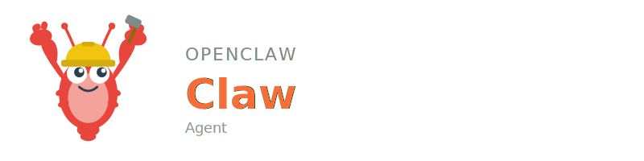

<p align="center">
  
</p>

# Agent Claude / Builder

An autonomous software factory built on [OpenClaw](https://docs.openclaw.ai/) and Elixir/OTP. It orchestrates multiple [Claude Code](https://docs.anthropic.com/en/docs/claude-code) CLI sessions to build software end-to-end through messaging platforms (WhatsApp, Telegram, Discord).

## Features

- **ARCHITECT mode** — DDD expert, security architect, code reviewer, quality and DevOps engineer. Plans architecture and decomposes tasks.
- **BUILDER mode** — Session orchestrator and TDD implementation lead. Launches Claude CLI sessions, monitors progress, and auto-responds to routine questions.
- **Execution loop** — Architecture > Execution > Quality Gate > Delivery + Code Review/PR Evaluation
- **Factory HTTP API** — Launch, monitor, kill, and review Claude CLI sessions via REST + SSE
- **Code review engine** — Weighted scoring (0–100%) with codebase and PR review modes
- **Multi-channel** — Works over WhatsApp, Telegram, Discord, or the built-in web chat UI

## Skills

| Skill | Description |
|-------|-------------|
| `session_spawn` | Spawn a new Claude Code CLI session for a task in a given working directory |

Workspace skills also available: `iamq_message_send`, `log_learning`, `improve_skill`

Skills auto-improve via post-execution hooks and nightly batch review.

## Architecture

- **Language**: Elixir/OTP (`factory/`)
- **IAMQ ID**: `agent_claude`
- **Runtime**: Docker (two containers: `openclaw` gateway + `factory` session manager)

```
User (WhatsApp / Telegram / Discord)
  → OpenClaw Gateway (Node.js, :18789)
  → Agent (AGENTS.md + SOUL.md + spec/)
  → Factory (Elixir/OTP, :4000) via HTTP/SSE
  → Claude CLI Sessions via Erlang Ports
  → Code changes, tests, commits in target repos
```

The `factory/` subdirectory is the Elixir session manager with `GenServer` per CLI session, lifecycle management, code review scoring, and a PubSub event bus.

## Setup

```bash
git clone https://github.com/r3dlex/openclaw-agent-claude.git
cd openclaw-agent-claude
cp .env.example .env
# Set AGENT_DATA_DIR; optionally set channel tokens
./scripts/setup.sh --docker --detach
# Open http://localhost:18789 for the web chat UI
```

### Docker Volume Mounts

```yaml
- ../skills-cli:/skills-cli:ro
- ../skills:/workspace/skills:rw
- ./skills:/agent/skills:rw
```

Environment: `EMBEDDINGS_URL=http://host.docker.internal:18795`

## Development

```bash
# Factory only
cd factory && mix deps.get
AGENT_DATA_DIR=./data FACTORY_PORT=4000 mix run --no-halt

# Run pipeline tests
cd tools/pipeline_runner && poetry install
poetry run pipeline run full --project ../..

# Pair a messaging channel
openclaw pairing whatsapp    # Scan QR code
openclaw pairing telegram    # Enter bot token
```

See [spec/ORCHESTRATION.md](spec/ORCHESTRATION.md) for the full Factory API reference.

## Related

- [openclaw-inter-agent-message-queue](https://github.com/r3dlex/openclaw-inter-agent-message-queue) — IAMQ message bus and agent registry
- [openclaw-main-agent](https://github.com/r3dlex/openclaw-main-agent) — Cross-agent pipeline orchestrator

## License

[MIT](LICENSE)
